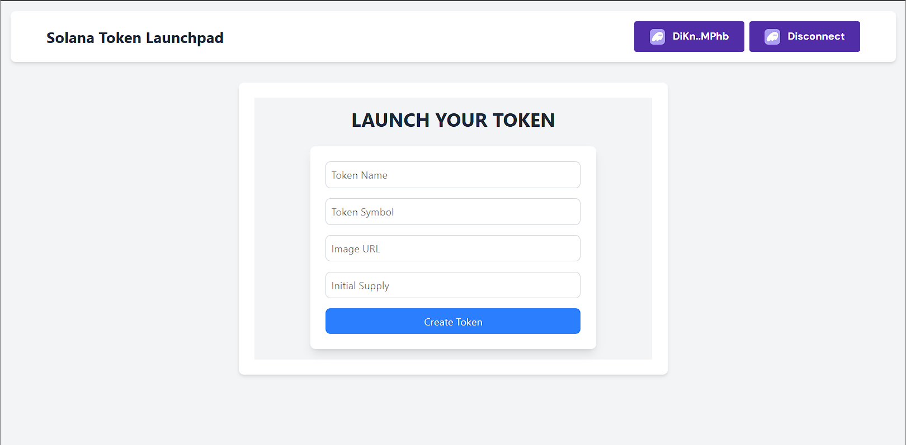

# Solana Token Launchpad

A web-based application to create and manage custom tokens on the Solana blockchain. Built with React, TypeScript, Tailwind CSS, and the Solana Web3.js library.

## Features

- **Create Tokens**: Easily create new SPL tokens on the Solana.
- **Dynamic Metadata**: Set token name, symbol, image URL, and initial supply.
- **Wallet Integration**: Connect with popular Solana wallets like Phantom.
- **Responsive Design**: Works seamlessly on desktop and mobile devices.

## Technologies Used

- **Frontend**: React, TypeScript, Tailwind CSS
- **Blockchain**: Solana Web3.js, SPL Token Program
- **Wallet Integration**: Solana Wallet Adapter
- **Build Tool**: Vite

## What This Project Taught Me

Building the Solana Token Launchpad was an incredible learning experience. Here are some of the key takeaways and skills I gained from this project:

### 1. **Understanding Solana Blockchain**
   - Learned how the Solana blockchain works.
   - Explored the **SPL Token Program** and how it enables the creation and management of custom tokens.
   - Gained hands-on experience with Solana's **on-chain accounts**, **transactions**, and **RPC endpoints**.

### 2. **Working with Solana Web3.js**
   - Used the `@solana/web3.js` library to interact with the Solana blockchain.
   - Learned how to create and send transactions, manage accounts, and handle errors.
   - Explored advanced concepts like **metadata pointers** and **token extensions**.

### 3. **Wallet Integration**
   - Integrated Solana wallets (e.g., Phantom) using the `@solana/wallet-adapter` library.
   - Learned how to handle wallet connections, sign transactions, and manage wallet states.

### 4. **Error Handling and Debugging**
   - Developed robust error handling mechanisms for blockchain transactions.
   - Learned how to debug and troubleshoot issues related to Solana's RPC endpoints and wallet interactions.

### 5. **Real-World Challenges**
   - Faced and solved real-world challenges like managing transaction fees, handling wallet disconnections, and ensuring data consistency.
   - Learned the importance of thorough testing and validation before deploying to Mainnet.

### 6. **Security Best Practices**
   - Understood the importance of securing private keys and sensitive data.
   - Learned how to implement secure transaction signing and wallet integration.

This project not only deepened my understanding of blockchain development but also taught me valuable lessons in problem-solving, project management, and continuous learning. I'm excited to apply these skills to future projects and contribute to the growing ecosystem of decentralized applications!